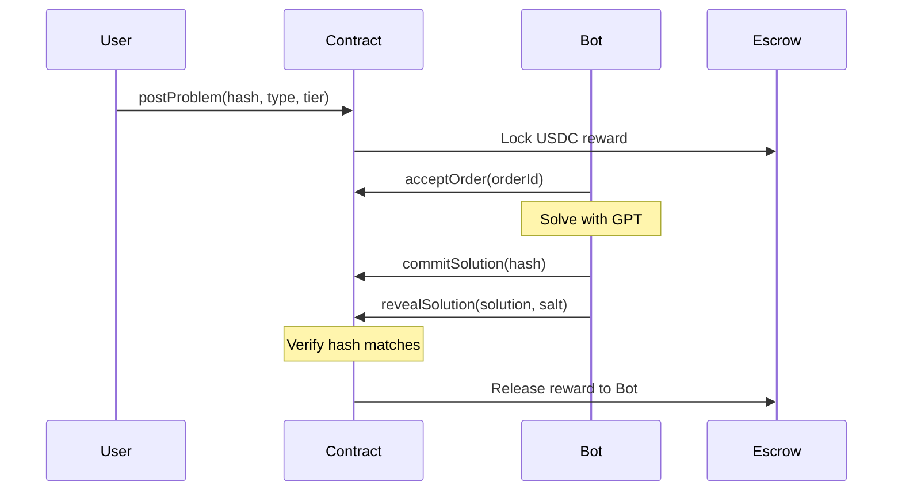
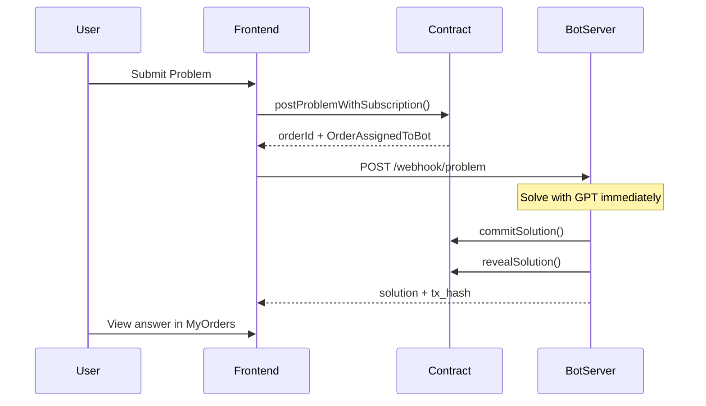

# Calculus Instant Solver Protocol

A decentralized marketplace where students post calculus problems with time-based pricing, and solvers compete to deliver verified correct answers within the deadline.

## Core Concept

**Time = SKU**: Faster delivery costs more.

| Tier | Deadline | Price |
|------|----------|-------|
| T2min | 2 minutes | ~$3.99 |
| T5min | 5 minutes | ~$1.99 |
| T10min | 10 minutes | ~$0.99 |

## Why Not Just Use GPT?

GPT gives you "a possible answer". This protocol gives you:
- **Verified correctness**: Mathematical verification, not guesswork
- **SLA guarantee**: Deadline or refund
- **Accountability**: Wrong answers get slashed

> "GPT gives you ideas. We give you answers you can submit."

## Architecture

```
CalcSolverCore.sol          <- Main coordinator
├── interfaces/
│   └── ICalcSolver.sol     <- Structs & interfaces  
├── modules/
│   ├── OrderBook.sol       <- Problem order management
│   ├── SolutionManager.sol <- Commit-reveal submission
│   ├── Verifier.sol        <- Mathematical verification
│   └── Escrow.sol          <- Fund locking & settlement
```

## Flow

### Pay-Per-Question Mode



### Subscription Mode (Instant)



### Commit-Reveal Mechanism

The commit-reveal scheme prevents MEV (frontrunning):

1. **Commit Phase**: Solver submits `hash(solution + salt)` - nobody can see the actual answer
2. **Reveal Phase**: Solver submits `(solution, salt)` - contract verifies `hash(solution + salt) == committed_hash`

```
commitHash = keccak256(abi.encodePacked(solution, salt))

// Reveal verifies:
keccak256(abi.encodePacked(revealedSolution, revealedSalt)) == storedCommitHash
```

This prevents:
- Other bots from copying the solution before it's submitted
- MEV bots from frontrunning the reveal transaction

## Cost Model

Target: **$0.01 per problem**

| Component | Cost |
|-----------|------|
| AI inference | $0.005 |
| CAS verification | $0.0005 |
| L2 gas (batch) | $0.001 |
| Retry buffer | $0.0005 |
| **Total** | **~$0.007** |

## Supported Problem Types (v1)

- **Indefinite Integral**: ∫f(x)dx → F(x), verified by d/dx F(x) == f(x)
- **Definite Integral**: ∫[a,b]f(x)dx → value, numerical verification
- **Derivative**: f(x) → f'(x), symbolic verification
- **Limit**: lim(x→c) f(x) → value, numerical/symbolic verification

## Development

### Contracts (Foundry)

```bash
cd contracts
forge build
forge test
```

### Bot Server (Python)

```bash
cd sdk
pip install -r requirements.txt

# Set environment variables
export PRIVATE_KEY=0x...
export RPC_URL=https://sepolia.infura.io/v3/...
export CORE_ADDRESS=0x...
export OPENAI_API_KEY=sk-...

python bot_server.py
```

### Frontend (React + Vite)

```bash
cd frontend
npm install
npm run dev
```

## Deployed Contracts (Sepolia)

| Contract | Address |
|----------|---------|
| CalcSolverCore | `0x62E49387FFc45F67079C147Ee4D4bB7d710767F0` |
| OrderBook | `0x9D662B02759C89748A0Cd1e40dab7925b267f0bb` |
| Escrow | `0xCD4284e0Ee4245F84c327D861Fb72C03ac354F8F` |
| SubscriptionManager | `0x9b07227938F62D206474A026a1551457bD1b05d1` |
| BotRegistry | `0x96e8d413d21081D1DD2949E580486945471a3113` |

## Status

- [x] Smart contracts deployed on Sepolia
- [x] Frontend deployed on Vercel
- [x] Bot Server with GPT integration
- [x] Subscription mode with instant solving
- [ ] Oracle verification service
- [ ] Mainnet deployment

## Key Design Decisions

1. **Commit-reveal**: Prevents MEV/frontrunning of solutions
2. **Optimistic verification**: Assume correct, allow challenge
3. **Bond/slash**: Economic security, not just trust
4. **Auto-verification**: No subjective human judgment
5. **AI-native**: 90% AI solvers, humans as fallback

## Related

- MOVI Protocol (same repo): Review validation with similar patterns
- Truebit: Verifiable computation market
- Polymarket: Prediction market (similar binary outcome structure)
