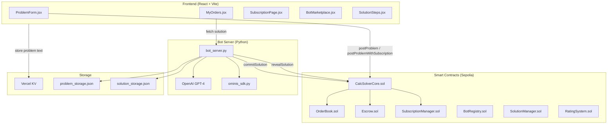
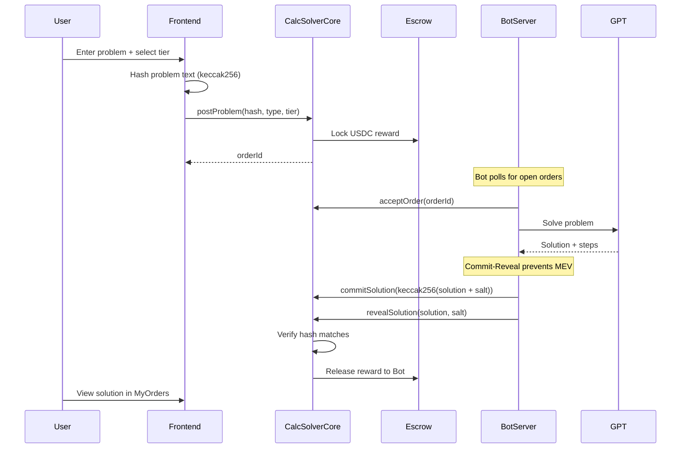
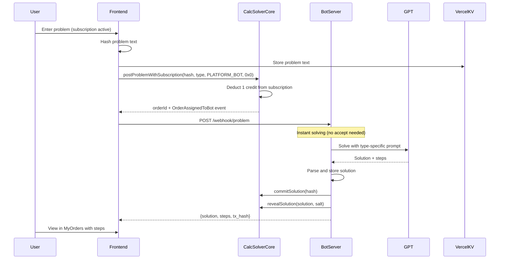
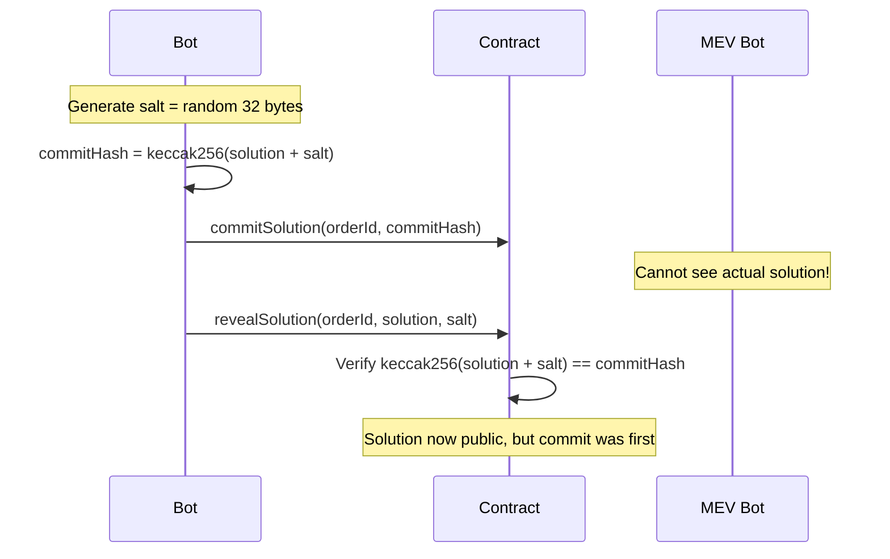
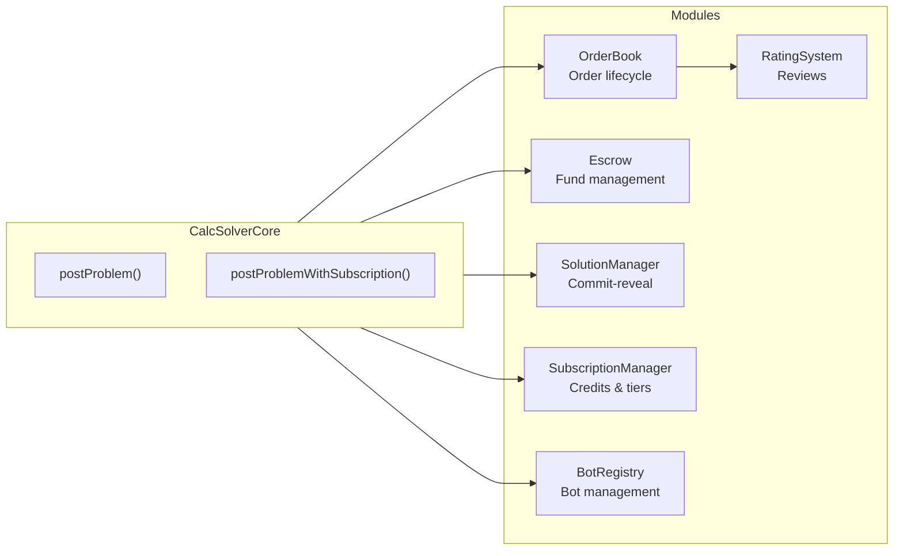
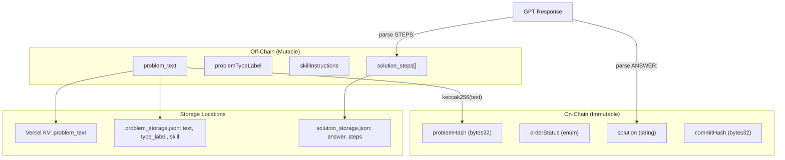
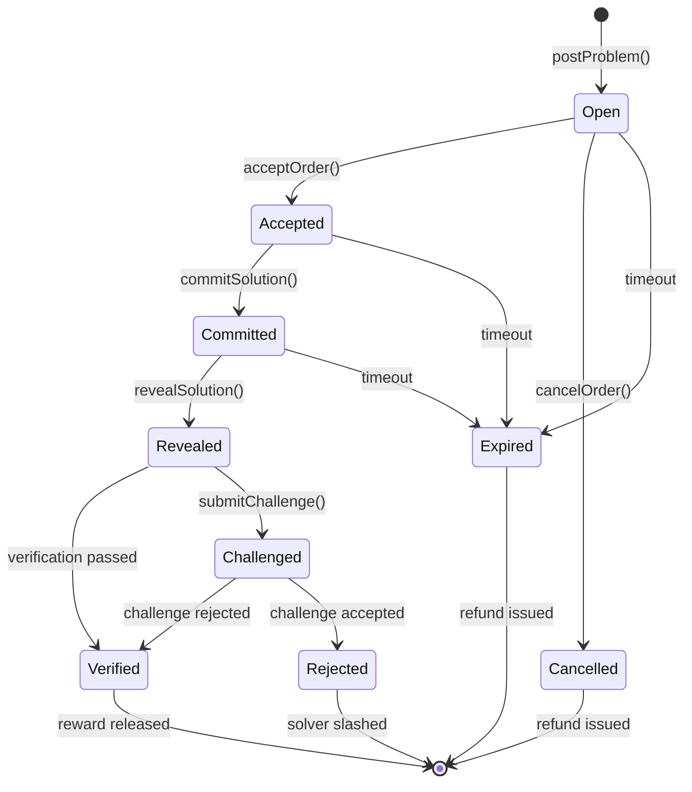

# Ominis Solver Marketplace - Technical Context

> A decentralized marketplace where users post math problems with time-based pricing, and AI-powered bots compete to deliver verified correct answers within the deadline. The protocol provides **verified correctness** (not guesswork), **SLA guarantees** (deadline or refund), and **accountability** (wrong answers get slashed).

---

## System Architecture



---

## Core Flows

### Pay-Per-Question Flow

Users pay USDC per problem. Bots compete to accept and solve.



### Subscription Mode Flow (Instant)

Subscribers get instant solutions without per-problem payment.



### Commit-Reveal Mechanism

Prevents MEV (frontrunning) of solutions:



---

## Contract Architecture

### Deployed Contracts (Sepolia)

| Contract | Address | Purpose |
|----------|---------|---------|
| CalcSolverCore | `0x62E49387FFc45F67079C147Ee4D4bB7d710767F0` | Main coordinator |
| OrderBook | `0x9D662B02759C89748A0Cd1e40dab7925b267f0bb` | Problem order management |
| Escrow | `0xCD4284e0Ee4245F84c327D861Fb72C03ac354F8F` | Fund locking & settlement |
| SolutionManager | `0x1D4e7970F7A709A33A319EE166E37C76e1178D13` | Commit-reveal submission |
| SubscriptionManager | `0x9b07227938F62D206474A026a1551457bD1b05d1` | Subscription & credits |
| BotRegistry | `0x96e8d413d21081D1DD2949E580486945471a3113` | Bot registration |
| RatingSystem | `0xfb4c8495Cb53dF5d1d4AA7883357c58d764B2870` | User reviews |
| USDC | `0x496e1D036D018C0930fBd199e30738efE0B4B753` | Payment token |

### Module Responsibilities



---

## Data Flow

### On-Chain vs Off-Chain Data



---

## Problem Types and GPT Prompting

### Supported Problem Types

| ID | Name | Icon | Prompt Label | On-Chain Type |
|----|------|------|--------------|---------------|
| 0 | Derivative | ∂ | `derivative` | 0 |
| 1 | Integral | ∫ | `integral` | 1 |
| 2 | Limit | lim | `limit` | 2 |
| 3 | Differential Eq | dy/dx | `differential equation` | 3 |
| 4 | Series | Σ | `series/summation` | 4 |
| 0 | Linear Algebra | ⊕ | `linear algebra` | 0 (general) |
| 0 | Statistics | σ | `statistics` | 0 (general) |
| 0 | Probability | P | `probability` | 0 (general) |
| 0 | Number Theory | ℤ | `number theory` | 0 (general) |
| 0 | Geometry | △ | `geometry` | 0 (general) |
| 0 | Other | ? | (user-defined) | 0 (general) |

### GPT Prompt Structure

```
You are a {problemTypeLabel} expert. Solve this {problemTypeLabel} problem step by step.

{problem_text}

{skillInstructions block - if provided}

Format your response EXACTLY like this:
STEPS:
1. [First step description] => [Result of this step]
2. [Second step description] => [Result of this step]
...

ANSWER: [final answer only, in simplest form]

{type-specific example}
```

### GPT Response Parsing

```python
# Extract steps: numbered lines between STEPS: and ANSWER:
steps_match = re.search(r'STEPS:\s*\n([\s\S]*?)(?:ANSWER:|$)', content)

# Extract answer: everything after ANSWER: to end (multi-line safe)
answer_match = re.search(r'ANSWER:\s*([\s\S]*)', content)
```

---

## API Endpoints

### Bot Server (`bot_server.py`)

| Method | Endpoint | Purpose |
|--------|----------|---------|
| GET | `/` | Health check |
| GET | `/status` | Bot status, wallet, orders |
| POST | `/start` | Start bot loop |
| POST | `/stop` | Stop bot loop |
| POST | `/solve` | Solve a problem (manual trigger) |
| POST | `/solve-assigned` | Solve an assigned order |
| POST | `/webhook/problem` | Webhook for instant solving |
| POST | `/problems` | Store problem text |
| GET | `/problems/<hash>` | Get problem text by hash |
| GET | `/solutions/<order_id>` | Get solution for order |
| GET | `/solutions/<order_id>/steps` | Get solution steps |
| POST | `/solutions/<order_id>/resolve` | Re-solve and overwrite |
| GET | `/solutions` | List all solutions |
| POST | `/solutions/<order_id>/verify` | Update verification status |

### Vercel API (`frontend/api/`)

| Method | Endpoint | Purpose |
|--------|----------|---------|
| POST | `/api/problems` | Store problem in Vercel KV |
| GET | `/api/problems?hash=...` | Get problem from Vercel KV |

---

## File Structure

```
aominis/
├── contracts/
│   ├── CalcSolverCore.sol          # Main coordinator contract
│   ├── interfaces/
│   │   └── ICalcSolver.sol         # Structs & interfaces
│   └── modules/
│       ├── OrderBook.sol           # Order lifecycle
│       ├── SolutionManager.sol     # Commit-reveal
│       ├── Verifier.sol            # Math verification
│       ├── Escrow.sol              # Fund management
│       ├── SubscriptionManager.sol # Subscription tiers
│       ├── BotRegistry.sol         # Bot registration
│       └── RatingSystem.sol        # Reviews
├── frontend/
│   ├── src/
│   │   ├── App.jsx                 # Main app
│   │   ├── config.js               # Contract addresses, ABIs, types
│   │   ├── components/
│   │   │   ├── ProblemForm.jsx     # Submit problem UI
│   │   │   ├── MyOrders.jsx        # View orders & solutions
│   │   │   ├── SolutionSteps.jsx   # Display solution steps
│   │   │   ├── MarkdownRenderer.jsx # Render Markdown + LaTeX
│   │   │   ├── SubscriptionPage.jsx # Manage subscription
│   │   │   ├── BotMarketplace.jsx  # Select bot
│   │   │   └── ...
│   │   └── main.jsx
│   ├── api/
│   │   └── problems.js             # Vercel serverless API
│   └── vercel.json
├── sdk/
│   ├── bot_server.py               # Main bot server (Flask)
│   ├── ominis_sdk.py               # Web3 SDK for contracts
│   ├── requirements.txt
│   └── examples/
│       └── solver_bot.py
├── indexer/                        # Event indexer (optional)
├── verifier/                       # Oracle verification service
├── README.md
├── DEPLOYMENT_GUIDE.md
└── context.md                      # This file
```

---

## Environment Variables

### Bot Server (`sdk/.env`)

```env
# Required
PRIVATE_KEY=0x...                    # Solver wallet private key
RPC_URL=https://sepolia.infura.io/v3/... # Ethereum RPC
CORE_ADDRESS=0x62E49387FFc45F67079C147Ee4D4bB7d710767F0
ORDERBOOK_ADDRESS=0x9D662B02759C89748A0Cd1e40dab7925b267f0bb
OPENAI_API_KEY=sk-...                # For GPT solving

# Optional
BOT_LOOP_INTERVAL=10                 # Seconds between checks
AUTO_SOLVE_ENABLED=true
```

### Frontend (`frontend/.env`)

```env
VITE_BOT_SERVER_URL=https://aominis-quantl.pythonanywhere.com
KV_REST_API_URL=...                  # Vercel KV
KV_REST_API_TOKEN=...
```

---

## Deployment

| Component | Platform | URL |
|-----------|----------|-----|
| Frontend | Vercel | (your-app.vercel.app) |
| Bot Server | PythonAnywhere | https://aominis-quantl.pythonanywhere.com |
| Contracts | Sepolia | See contract addresses above |

### Deployment Commands

```bash
# Contracts (Foundry)
cd contracts
forge build
forge test
forge script script/Deploy.s.sol --rpc-url $RPC_URL --broadcast

# Frontend (Vercel)
cd frontend
npm install
npm run build
vercel --prod

# Bot Server (local)
cd sdk
pip install -r requirements.txt
python bot_server.py
```

---

## Order Status Flow



---

## Subscription Tiers

| Tier | Name | Price/Month | Credits | Features |
|------|------|-------------|---------|----------|
| 0 | Free | $0 | 5 | Basic solving |
| 1 | Study | $9.99 | 100 | Step-by-step |
| 2 | Study+ | $14.99 | Unlimited | Premium bots |
| 3 | Expert | $24.99 | Unlimited | Priority + refund guarantee |

---

## Development Workflow

### After Making Changes

1. **Check for errors**: Run linter on edited files (`ReadLints`)
2. **Verify functionality**: If server is running, test the changes work
3. **Fix before proceeding**: Do not leave introduced errors unfixed

### Debugging Errors

When something doesn't work, check these sources:

1. **PythonAnywhere Server Logs**
   - Location: PythonAnywhere dashboard → Web → Error log / Server log
   - Shows Python exceptions, GPT errors, transaction failures
   - Check timestamps to find relevant errors

2. **Etherscan Transaction Errors**
   - Given a `tx_hash`, check on Sepolia Etherscan: `https://sepolia.etherscan.io/tx/{tx_hash}`
   - Look at "Status" (Success/Fail), "Error" message if failed
   - Check "Input Data" to see what was sent
   - Common issues: insufficient gas, revert reasons, wrong parameters

3. **Storage vs Display Mismatches**
   - **Backend storage**: Check `solution_storage.json` or call `GET /solutions/{order_id}`
   - **Frontend display**: Compare what `MyOrders.jsx` / `SolutionSteps.jsx` renders
   - **Common issues**:
     - Answer truncated during parsing (check `parse_gpt_solution` regex)
     - Markdown/LaTeX not rendering (check `MarkdownRenderer.jsx`)
     - Data not fetched (check API call in frontend)

4. **GPT Response Issues**
   - Check if GPT returned expected format (`STEPS:` ... `ANSWER:`)
   - Check parsing logic in `bot_server.py` → `parse_gpt_solution()`
   - Multi-line answers need `[\s\S]*` regex, not `.+`

### Git Commits

- **Only commit when explicitly requested** by user
- **Verify changes first**: Run `git status` and `git diff` before committing
- **Descriptive messages**: Summarize the "why", not just "what"
- **Never force push** or amend already-pushed commits
- **Use HEREDOC** for commit messages with special characters

### Code Cleanup (on request)

When user asks for cleanup, identify and remove:

- **Unused imports** and variables
- **Dead code**: Unreachable or commented-out code
- **Unused functions**: Functions that are defined but never called
- **Redundant logic**: Duplicate code that can be consolidated
- **Obsolete fallbacks**: Placeholder code no longer needed
- **Keep DRY**: Don't Repeat Yourself - consolidate duplicates

### Checklist Before Finishing a Task

```
[ ] Linter errors checked and fixed
[ ] Changes tested (if applicable)
[ ] No unused code left behind
[ ] Commit made (if requested)
```

---

## Key Design Decisions

1. **Commit-reveal**: Prevents MEV/frontrunning of solutions
2. **Optimistic verification**: Assume correct, allow challenge period
3. **Bond/slash**: Economic security through staking
4. **Auto-verification**: Mathematical verification, no human judgment
5. **AI-native**: 90% AI solvers, humans as fallback
6. **Off-chain problem text**: Only hash on-chain for gas efficiency
7. **Type-specific prompting**: Different GPT prompts per problem type
